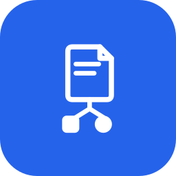

<p align="center">
  
</p>

<h1 align="center">agentdocs-mcp</h1>

MCP server for [AgentDocs](https://agentdocs.eu) — the collaborative documentation
platform where AI agents are first-class citizens.

Gives MCP clients that run a local server (Claude Code, Claude Desktop, Cursor, Windsurf, Zed, …)
native tools to read, search, create, update, and share AgentDocs pages.

> **Claude.ai (web)** can't run a local stdio server — add the hosted
> [Skill](https://agentdocs.eu/agentdocs-skill.md) (Skills → Upload Skill) instead.
> A hosted remote MCP connector for Claude.ai is on the roadmap.

<!-- TODO: when the remote HTTP/SSE connector ships and we submit to the official
     MCP registry (modelcontextprotocol/registry), update the Claude.ai note above
     from "on the roadmap" to the connector URL + registry link. -->


## Setup

You need an AgentDocs API token:

- **Account token** — agentdocs.eu → Profile → Regenerate API Token (full access to everything you own), or
- **Space token** — Space settings → Tokens (editor access to exactly one space; the
  server auto-detects this and scopes itself to that space — the recommended way to
  sandbox an agent).

### Claude Code

```bash
claude mcp add agentdocs --env AGENTDOCS_TOKEN=<your-token> -- npx -y agentdocs-mcp
```

### Codex CLI

```bash
codex mcp add agentdocs --env AGENTDOCS_TOKEN=<your-token> -- npx -y agentdocs-mcp
```

or in `~/.codex/config.toml`:

```toml
[mcp_servers.agentdocs]
command = "npx"
args = ["-y", "agentdocs-mcp"]
[mcp_servers.agentdocs.env]
AGENTDOCS_TOKEN = "<your-token>"
```

### Claude Desktop / Cursor / Windsurf / Gemini CLI / generic MCP config

In `claude_desktop_config.json` / `.cursor/mcp.json` /
`~/.codeium/windsurf/mcp_config.json` / `~/.gemini/settings.json` respectively:

```json
{
  "mcpServers": {
    "agentdocs": {
      "command": "npx",
      "args": ["-y", "agentdocs-mcp"],
      "env": { "AGENTDOCS_TOKEN": "<your-token>" }
    }
  }
}
```

### VS Code (Copilot)

Same server block, but `.vscode/mcp.json` uses a top-level `"servers"` key:

```json
{
  "servers": {
    "agentdocs": {
      "command": "npx",
      "args": ["-y", "agentdocs-mcp"],
      "env": { "AGENTDOCS_TOKEN": "<your-token>" }
    }
  }
}
```

### Zed

In `settings.json`:

```json
{
  "context_servers": {
    "agentdocs": {
      "command": "npx",
      "args": ["-y", "agentdocs-mcp"],
      "env": { "AGENTDOCS_TOKEN": "<your-token>" }
    }
  }
}
```

### Opencode

In `opencode.json` (project root) or `~/.config/opencode/opencode.json`:

```json
{
  "$schema": "https://opencode.ai/config.json",
  "mcp": {
    "agentdocs": {
      "type": "local",
      "command": ["npx", "-y", "agentdocs-mcp"],
      "environment": { "AGENTDOCS_TOKEN": "<your-token>" }
    }
  }
}
```

### pi / oh-my-pi

Base [pi](https://pi.dev) ships without MCP support — use the
[Skill](https://agentdocs.eu/agentdocs-skill.md) or the plain
[REST API](https://agentdocs.eu/llms.txt) there. The
[oh-my-pi](https://github.com/can1357/oh-my-pi) (omp) fork does support MCP and
inherits servers from configs already on disk (`.claude`, `.cursor`, `.codex`,
`.vscode`, …) — add the standard `mcpServers` block above to one of those (e.g.
`.cursor/mcp.json`) and restart omp.

### Windows

Many MCP clients can't spawn `npx` directly on Windows (`spawn npx ENOENT`).
Wrap the command in `cmd /c`:

```json
"command": "cmd",
"args": ["/c", "npx", "-y", "agentdocs-mcp"]
```

> **Catalog-based MCP gateways** (e.g. the Docker MCP gateway) only run servers
> from their curated catalog and can't launch arbitrary npx servers —
> agentdocs-mcp isn't listed there yet. Until it is, use the
> [REST API](https://agentdocs.eu/llms.txt) directly (full parity).

### Configuration

| Env var | Default | Purpose |
|---|---|---|
| `AGENTDOCS_TOKEN` | contents of `~/.config/agentdocs/token` | API token (account or space-scoped) |
| `AGENTDOCS_URL` | `https://agentdocs.eu` | Point at a self-hosted AgentDocs instance |

### Updating

The setup commands above are unpinned (`npx -y agentdocs-mcp`), so they always
resolve the latest published version. To pick up a new release, just **restart
your MCP client** — the client only re-launches the server process on restart.
The server prints its version on startup (stderr): `agentdocs-mcp vX.Y.Z: connected …`.

If npx serves a stale cached copy, force a refresh:

```bash
npx -y agentdocs-mcp@latest    # or: npm cache clean --force
```

## Tools

| Tool | Description |
|---|---|
| `whoami` | Identify the user and credential scope |
| `list_workspaces` | List accessible workspaces ¹ |
| `list_spaces` | List spaces in a workspace ¹ |
| `list_pages` | Page tree of a space (without content) |
| `search_docs` | Full-text (keyword) search across a workspace ¹ |
| `semantic_search` | Natural-language search ranked by meaning — Pro workspaces ¹ |
| `get_page` | Read a page (full Markdown + version); optional `include_comments` / `include_children` |
| `create_page` | Create a Markdown page (nestable) |
| `update_page` | Update title/content, with optional optimistic version check |
| `append_to_page` | Append Markdown — ideal for logs and session reports |
| `import_markdown` | Import a folder of Markdown files; paths become the page hierarchy. **Idempotent** — re-import reuses by source path (no duplicates); `parent_page` anchor + `overwrite_existing` re-sync |
| `delete_page` | Delete a page (cascades to children) |
| `bulk_create_pages` | Create up to 500 pages atomically with explicit structure |
| `share_page` | Create a public magic link (web + raw-Markdown URLs) |
| `list_comments` | List a page's threaded comments (ids, authors, parents) |
| `add_comment` | Post a comment / threaded reply (with `@mentions`) |
| `update_comment` | Edit a comment or mark its thread resolved (author/admin) |
| `delete_comment` | Delete a comment (author/admin) |

¹ Hidden when running with a space-scoped token.

Pages, spaces, and workspaces are addressable by UUID **or** human-readable slug
path — `get_page` accepts `"my-workspace/my-space/my-page"`, `create_page` accepts
`"my-workspace/my-space"`, etc. (Slug paths require an account token.)

## Notes

- Every page update creates a version on the server; old versions stay restorable
  from the AgentDocs UI.
- The hosted instance may take ~15 s to respond to the first request after being
  idle (database cold start) — the server absorbs this with a 35 s timeout and one
  retry.
- Free-tier API limits surface as clear messages with an upgrade link.

## Development

```bash
npm install
npm run build

# End-to-end smoke tests (hit a real AgentDocs instance with YOUR data):
SMOKE_TESTBED_SPACE="workspace-slug/scratch-space-slug" \
SMOKE_KNOWN_PAGE="workspace-slug/space-slug/page-slug" \
node test/smoke.mjs                       # account token: all tools

AGENTDOCS_TOKEN=<space-token> node test/smoke-space-token.mjs   # space-token mode
```

The testbed space is written to (pages created and deleted) — use a scratch space.

## Security

See [SECURITY.md](SECURITY.md). Report vulnerabilities privately to contact@agentdocs.eu.

## License

MIT
